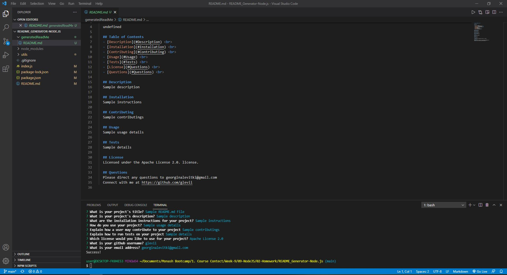

# README_Generator-Node.js

## Table of Contents

- [Description](#Description)
- [Installation](#Installation)
- [Usage](#Usage)
- [Links](#Links)
- [Questions](#Questions)

## Description

A command line application that dynamically generates a professional README.md file from a user's input by using the Inquirer package.

## Installation

Clone the respository then run an npm install.

## Usage

The application is invoked by using the command line "node index.js" in your bash terminal.

 
<a href="https://drive.google.com/file/d/1ii3nnJT8Rm1FJpKBDgoprn9EvDPnDVQS/view">Click here for Demo Video</a>

## Questions

For any questions feel free to reach out:  
Email: <georginalevitki@gmail.com>
